# Term 2 Assignment 2 - Marketplace Project ✅

## Volunteer for Earth - There's no planet B!

## Code/Technology Requirements

### R1 - Create your app using Ruby on Rails.

✅ Requirement met.

### R2 - Use Postgresql database in development and production.

✅ Requirement met.

### R3 - Your app will have authentication (eg. Devise).

✅ Requirement met. App authentication implemented using [Devise](https://github.com/heartcombo/devise).

### R4 - Your app will have authorisation (i.e. users have restrictions on what they can see and edit).

✅ Requirement met. [CanCanCan](https://github.com/CanCanCommunity/cancancan) used to implement app authorisation.

Email or username can be used to log in. Please see the following for credentials for users with different roles (they should work locally and on the deployed site):

- User
    - Email: user@user.com
    - Username: user
    - Password: test123

- Organisation
    - Email: organisation@organisation.com
    - Username: organisation
    - Password: test123

- Administrator
    - Email: admin@admin.com
    - Username: admin
    - Password: test123

### R5 - Your app will have some type of file (eg. images) uploading capability.

✅ Requirement met. When creating a new listing, an organisation is able to upload an image of their choice e.g. organisation logo. It's optional. This feature is implemented utilising AWS S3 bucket.

### R6 - Your app is to be deployed to Heroku (recommended) or AWS.

✅ Requirement met. The app is deployed to Heroku. Here's the [link](http://volunteer-for-earth.herokuapp.com/)

### O1 - A payment system for your product. (e.g. Stripe).

✅ Payment system implemented with Stripe Checkout. Anyone (no registration required) can make a donation via the 'Donate' link in the navbar.

Please note: the donation amount currently is hard-coded to ten dollars. Please stay tuned for an improvement of this feature to allow the generous people to enter an amount they want.

Test credit card details:

- Email: user@user.com
- Card number: 4242 4242 4242 4242
- Expiry date: 01/21
- CVC: 138

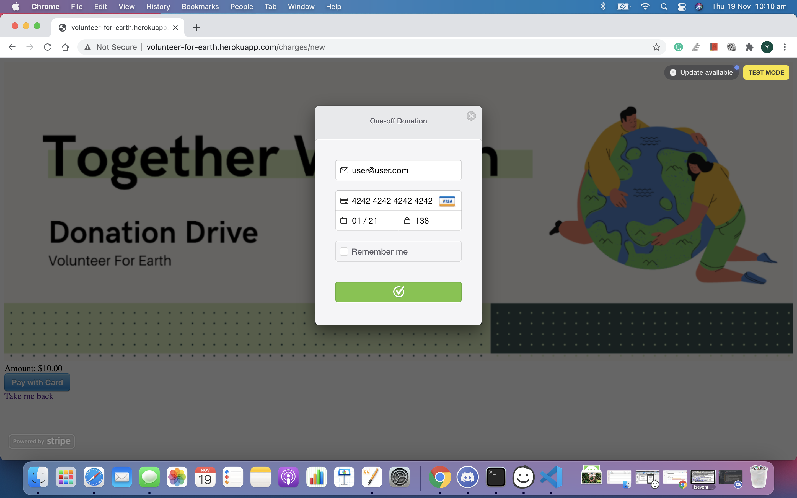

### O2 - A third party API (e.g. Omniauth, Geocoding, Maps, etc).

✅ Utilise the easy-to-use interface provided by rails_admin gem. Instead of re-inventing the wheel, the interface makes it easy for a site admin to manage data on a website.

### O3 - Transactional emails (eg. using Mailgun).

✅ The contact form on the app utilises SendGrid to send messages.

A screenshot of my SendGrid dashboard verifying emails that have been successfully sent using the contact form:

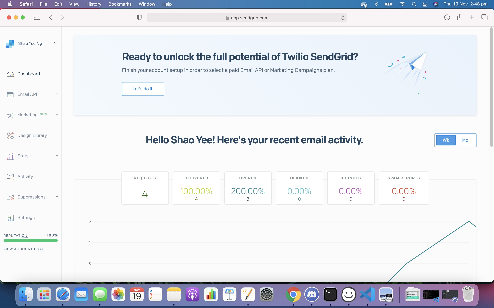

Please note: this feature currently only works locally. 😌

### O4 - Searching, sorting and/or filtering capability.

✅ Searching capability implemented with 'pg_search' gem.

All listings:

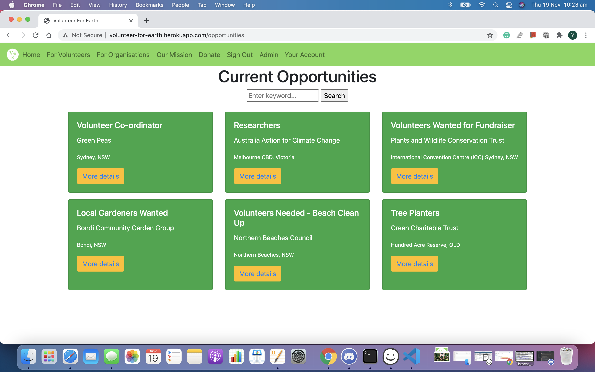

Search results using keyword "volunteers":

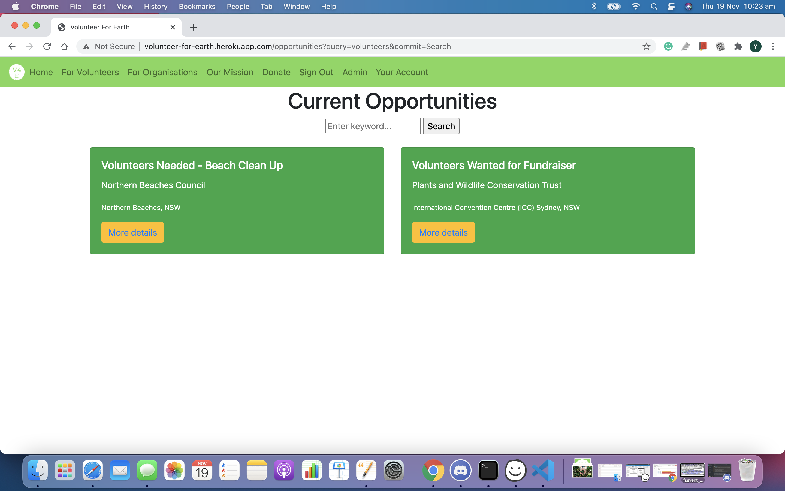

Please note: partial keywords don't work. In the example above, the string 'volunteers' must be entered to get the result of the two listings that contain the keyword 'volunteers'. If 'volunteer' is entered, the two listings wouldn't be included in the search result. The functionality of this search form will be improved in the future.

### O5 - Internal user messaging system within the app.

💔 Not implemented. Two precious days were spent on trying to implement this using mailboxer gem. This was when the newly purchased Macbook almost got thrown over the balcony. 🤬🤬🤬 Despite not being able to implement this in the end, learnt a lot during this process. *what doesn't kill you makes you stronger* 👊

### O6 - Admin dashboard for the admin user to administer the site.

✅ Admin dashboard implemented utilising rails_admin gem.

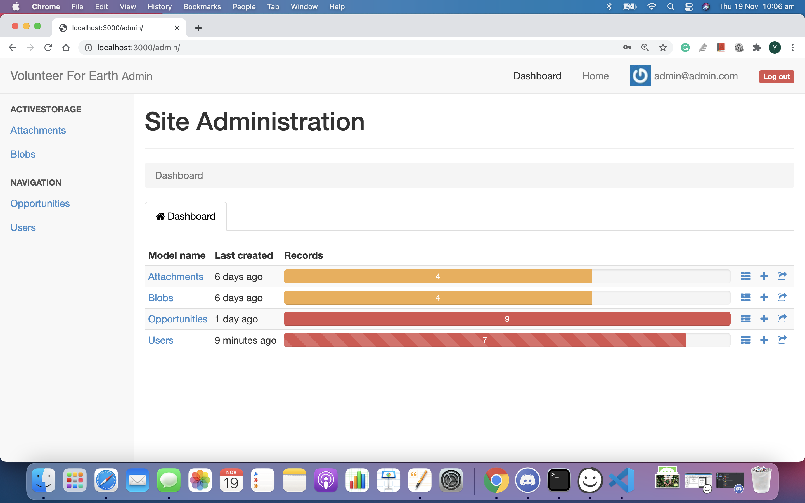

## Documentation Requirements

### R7 - Identification of the problem you are trying to solve by building this particular marketplace app.

🌏 While there are volunteer opportunity listing platforms in Australia, such as SEEK Volunteers, there currently is a gap in the market for a volunteer opportunity listing platform that is focussed on sustainability and climate change.

### R8 - Why is it a problem that needs solving?

In Australia, there is a growing number of people who are getting concerned about climate impacts, as there have been more frequent droughts, bushfires and flooding in recent years. There are people who are passionate about achieving a cleaner and greener planet. 🍀
 
As there is no consolidated volunteer opportunities platform dedicated to sustainability and climate change, these interested volunteers currently have to:

- Do their own searching and reach out to organisations directly; or 
- Sift through thousands of volunteer listings on existing volunteer opportunities platforms to find a cause that aligns with sustainability or climate change.

Due to this inefficiency, there may be thousands of potential volunteers that are not deployed towards the cause of sustainability and climate change, as it may be “too difficult”.

The goals of this project are to fill that gap and resolve the issues identified above.

### R9 - A link (URL) to your deployed app (i.e. website)

[Heroku](http://volunteer-for-earth.herokuapp.com/)

### R10 - A link to your GitHub repository (repo). - Ensure the repo is accessible by your Educators

[GitHub](https://github.com/yee-codes/volunteer_for_earth)

### R11 - Description of your marketplace app (website), including: - Purpose - Functionality / features - Sitemap - Screenshots - Target audience - Tech stack (e.g. html, css, deployment platform, etc)

Purpose:

To provide a volunteer opportunity platform where volunteers and organisations can connect to help with causes relating to sustainability or climate change.

Functionality / features:

- A well-designed and appealing landing page with a 'green' theme to entice web users to explore further.
- A page that displays all the current volunteer opportunities posted by various organisations.
- A search form that can be used to locate a listing or listings quickly.
- Approved organisations can create new listing via a easy-to-use form to look for volunteers.
- Anyone can register for an account, but any organisations that wish to create new listing will need to contact web admin to be granted organisation's privileges.
- A contact form is available for app users to contact web admin.
- Only web admin or organisation that has created a particular listing can update or delete the listing.
- Users who wish to contribute financially can do so via the donation page; donation payment can be made easily with a debit or credit card.
- Admin dashboard is only accessible to website administrator to moderate the app activities.

Sitemap:

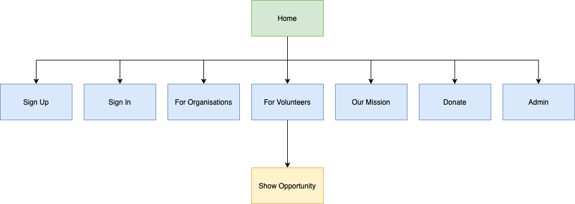

A few screenshots of the website:

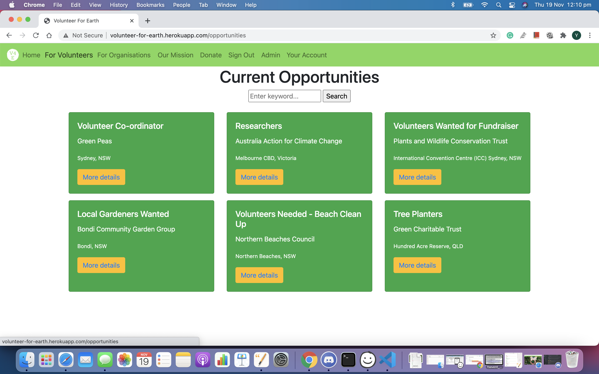
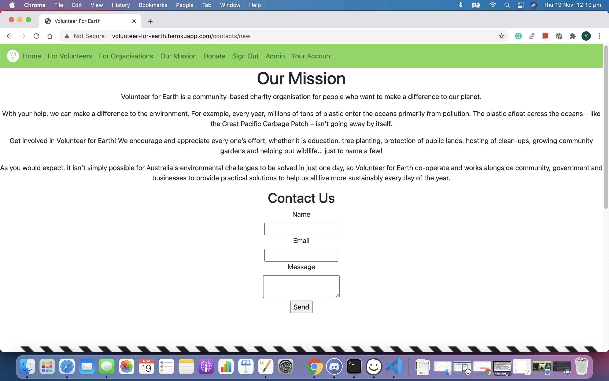
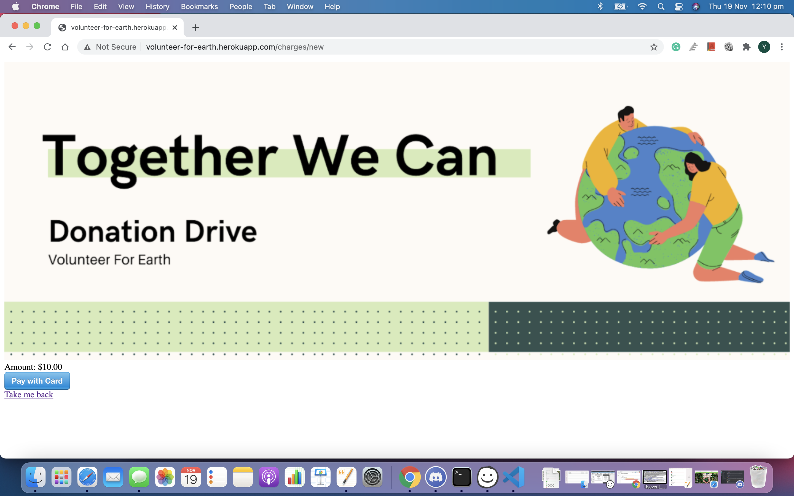
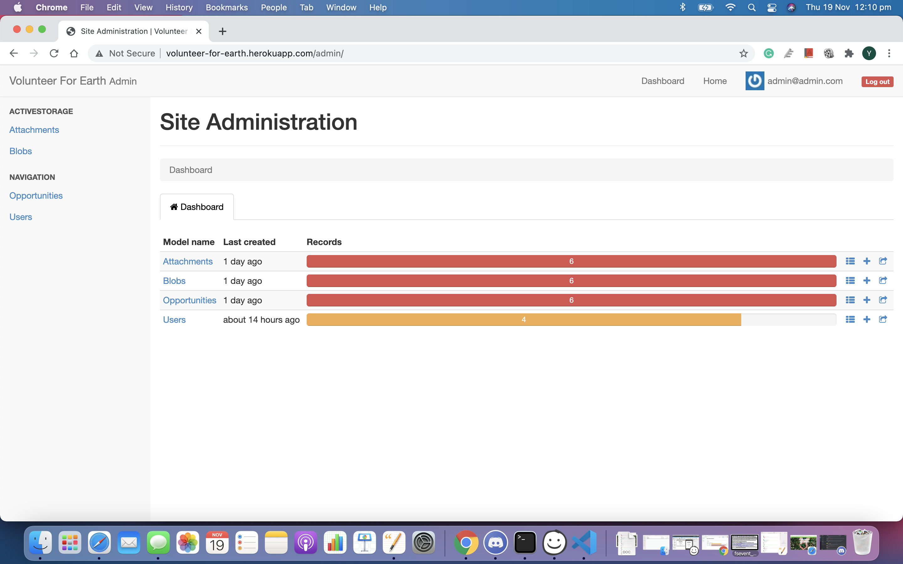

Target Audience:

Anyone in Australia who is interested in volunteering for sustainability and climate change causes.

Tech Stack:

- HTML
- CSS
- Bootstrap
- Various Ruby gems (e.g. pg_search, rails_admin, cancancan)
- AWS S3 (image upload)
- SendGrid (transactional email)
- Stripe (payment system)
- Devise (user authentication)
- Heroku (deployment)

### R12 - User stories for your app

- As a volunteer, I want to look for volunteer opportunities, so that I can contribute to the community.
- As a volunteer, I want to donate money to environmental protection causes, so that the environment can be protected.
- As a volunteer, I want to contact organisations who share the common purpose of environmental protection, so that I can connect with like-minded people.
- As an organisation, I want to look for volunteers, so that we can contribute to community projects.
- As an organisation, I want to donate money towards volunteer projects, so that our environment is preserved.
- As an organisation, I want to advertise to look for volunteers, so that interested people can support our cause.
- As an admin, I want to view user accounts and their activities, so that I can ensure users are acting in an appropriate and respectful manner.
- As an admin, I want to be able to remove user accounts, so that robots and people who act inappropriately can be removed from the site.

### R13 - Wireframes for your app

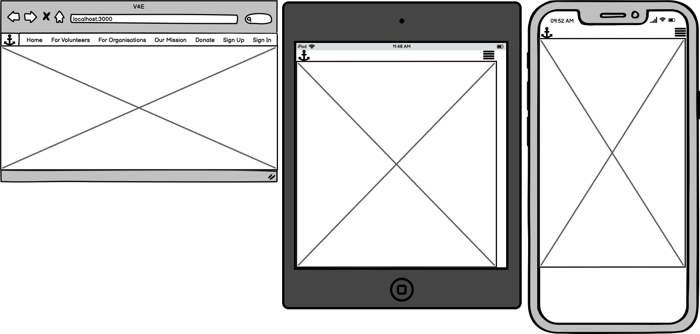
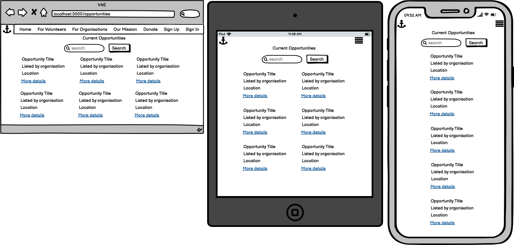
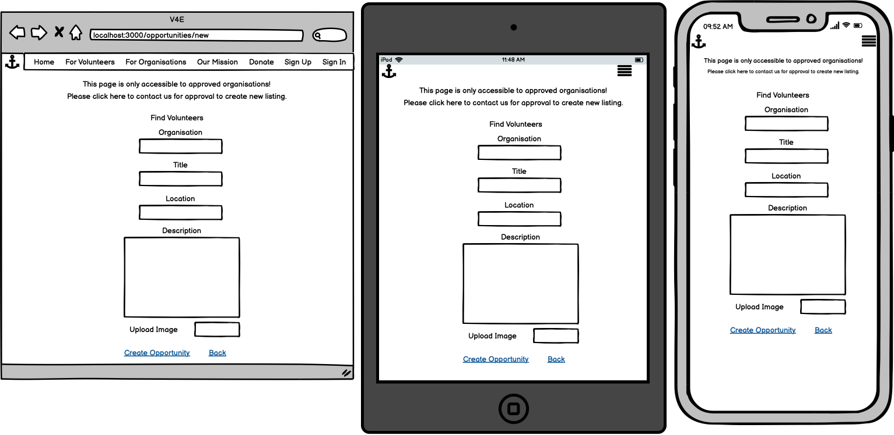
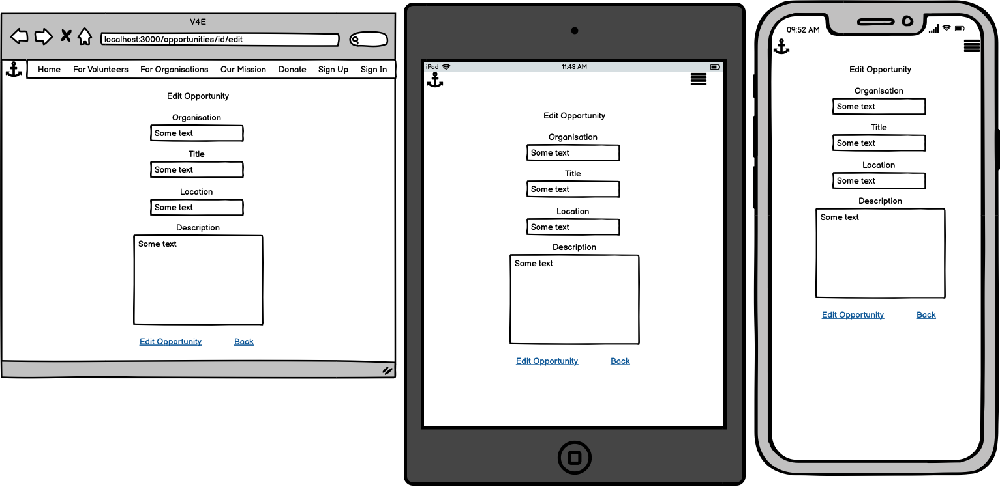
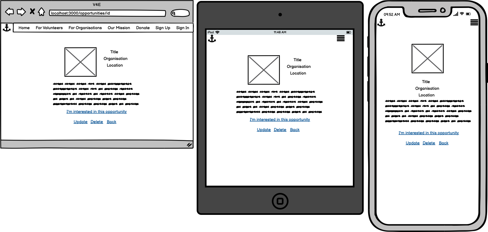
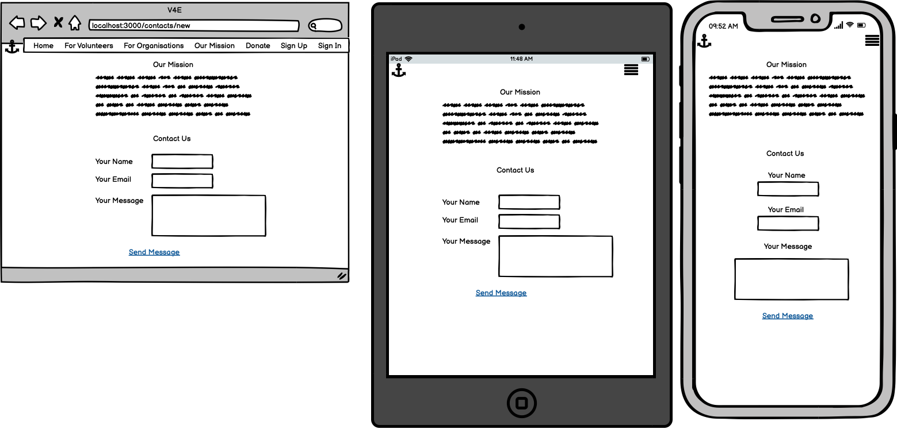
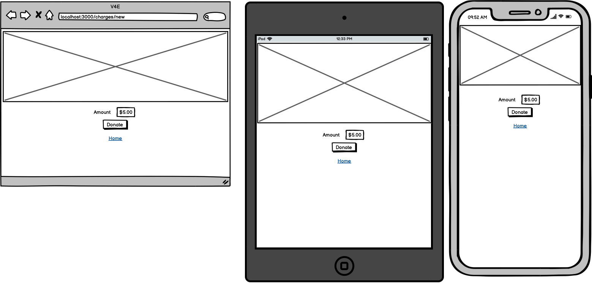
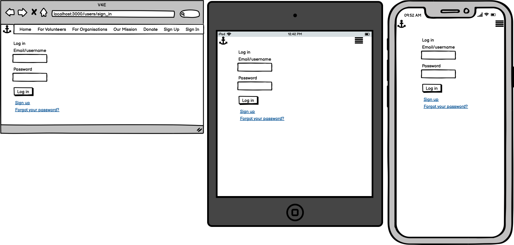
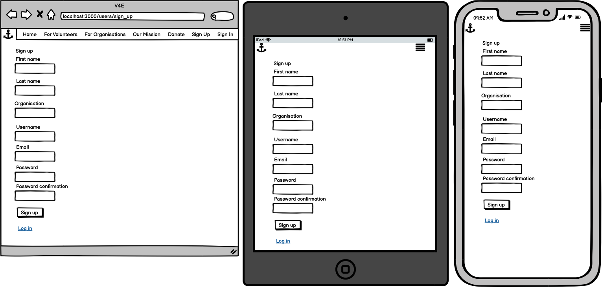
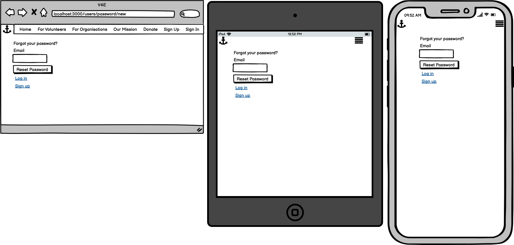

### R14 - An ERD for your app

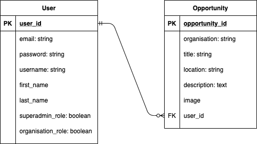

### R15 - Explain the different high-level components (abstractions) in your app

- Navbar: provide users with links to access different URLs within the website.
- Design: a 'green' theme and clean design to entice users to stay and explore the site further.
- Search form: allow users to use keyword to search for an organisation, listings or a location.
- User authentication: users must be registered and authenticated to access certain features, such as viewing the description of a listing.
- User authorisation: only authorised users are able to perform certain functions, such as creating a new listing or amending an existing listing.
- Contact form: allow users to contact website administrator for any questions or issues they may have.
- Donate button: allow users to make a donation using a debit or credit card.
- Admin dashboard: enable web admin to manage data of the website.

### R16 - Detail any third party services that your app will use

- Devise:
    - responsible for user authentication
    - register new users
    - authenticate returning users
    - provide registration form
    - provide form to change password
    - send email to users who have forgotten their password
    - ability to delete a registered account
    - email or username can be used to log in
    - widely used in the industry, even by some big companies
    - compatible with other commonly used third party services, such as cancancan

- Heroku
    - used for website deployment
    - provide useful add-ons, such as SendGrid
    - can be linked to GitHub for continuous integration
    - can be linked to GitHub and automatically re-deploy when remote repo is updated
    - free
    - easy to use

- AWS S3
    - used to store uploaded images on the cloud rather than store them locally
    - free, but credit card details required
    - when creating a new listing, an organisation is able to upload an image of their choice e.g. organisation logo

- Stripe
    - used for payment processing

Test credit card details:

- Email: user@user.com
- Card number: 4242 4242 4242 4242
- Expiry date: 01/21
- CVC: 138

- CanCanCan
    - used for user authorisation
    - compatible with devise making it easy to implement
    - come with useful helper methods
    - in the User model, there are two attributes used to define a user's role: organisation_role and superadmin_role. The value of both is a boolean and the default value is false
    - all website visitors can view all listings. Only registered users can see the description and have access to a link to contact an organisation
    - only an approved organisation can access the create form to create a new listing. In order for an organisation to be approved. an application needs to be submitted to the administrator. This can be done via the contact form available on the website. Once the application is approved, the user's 'organisation_role' will be changed from `false` to `true`
    - a listing can only be updated or deleted by the creator of the listing or web admin. Only the web admin has access to the admin dashboard

Email or username can be used to log in. Please see the following for credentials for users with different roles (they should work locally and on the deployed site):

- User
    - Email: user@user.com
    - Username: user
    - Password: test123

- Organisation
    - Email: organisation@organisation.com
    - Username: organisation
    - Password: test123

- Administrator
    - Email: admin@admin.com
    - Username: admin
    - Password: test123

- Rails_admin
    - provide interface for admin dashboard
    - a user with superadmin_role (i.e. superadmin_role: true) is created via rails console. ONLY a user with superadmin_role can access the admin dashboard. A link to the admin dashboard will only be visible in the navbar if the logged in user has superadmin_role

Please use the following credentials (it should work locally and on the deployed site):

- Email: admin@admin.com
- Username: admin
- Password: test123

### R17 - Describe your projects models in terms of the relationships (active record associations) they have with each other

There are two models in this app: users and opportunities. One user can have nil or many opportunity listings. One opportunity listing can only belong to one user.

### R18 - Discuss the database relations to be implemented in your application

User_id is used as a foreign key in the Opportunity model to identify the creator of a listing. When a new listing is created, the user_id is automatically attached to it. This association is useful as it helps with the implementation of a crucial user authorisation: a listing can only be updated or deleted by the creator.

### R19 - Provide your database schema design

In addition to the ERD attached above, please see below for the database schema design:

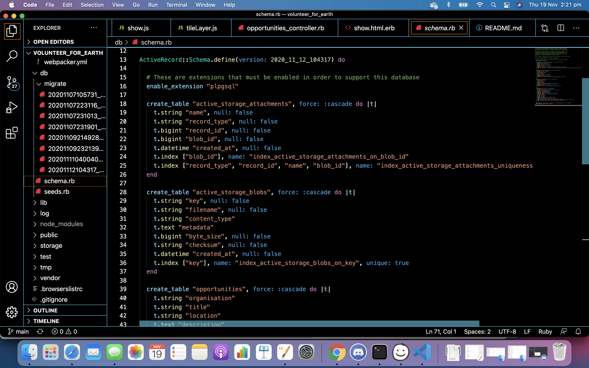
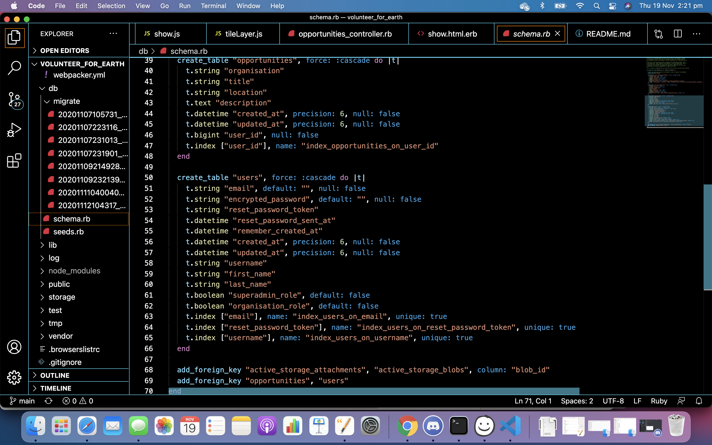

### R20 - Describe the way tasks are allocated and tracked in your project

Since the beginning of this project, the different phases (design, planning, implementation, deployment) and tasks are tracked via the use of a Trello board.

The phases are broken down into different lists, such as design/planning, implementation, URLs, user stories etc. Multiple tasks are allocated to each list accordingly. Each task is colour-labeled and assigned a due date to ensure the project is on track. Furthermore, each task is broken down into smaller units and these smaller units make up the checklist in each task/card.

The lists and tasks are constantly reviewed and updated throught the project.

Here is the link: [Trello](https://trello.com/b/zfHvZrd7/marketplace-project).

***THE END***
